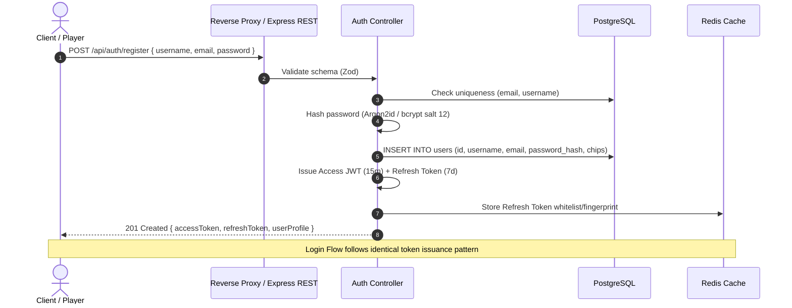
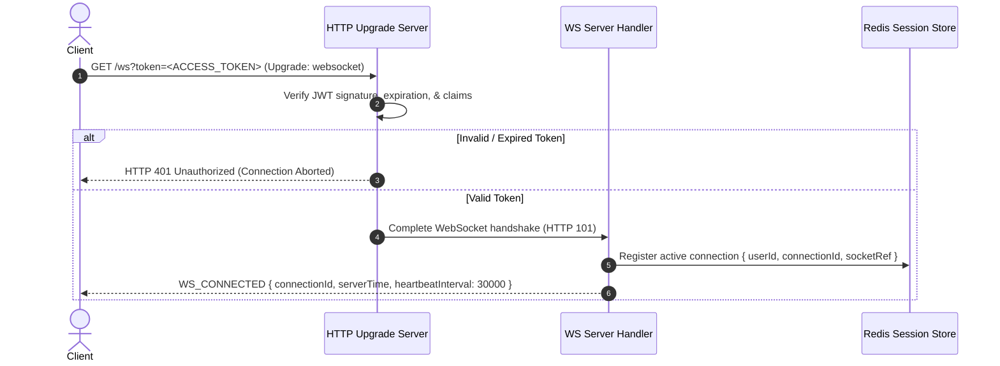
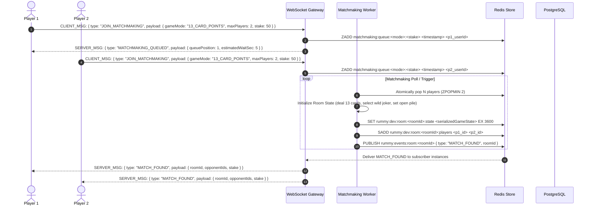
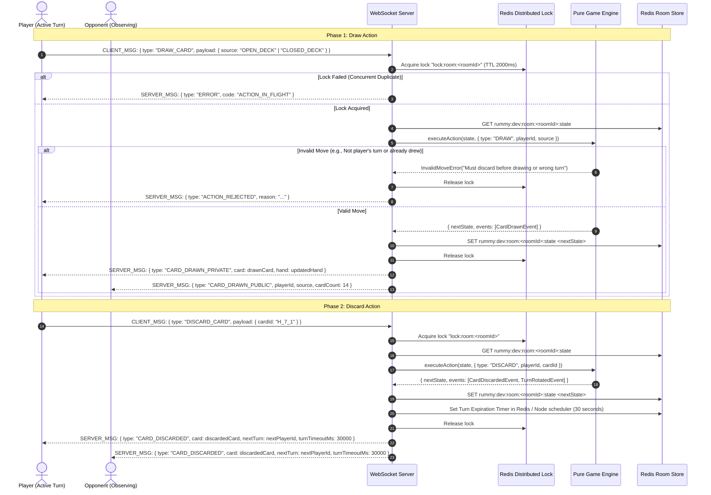
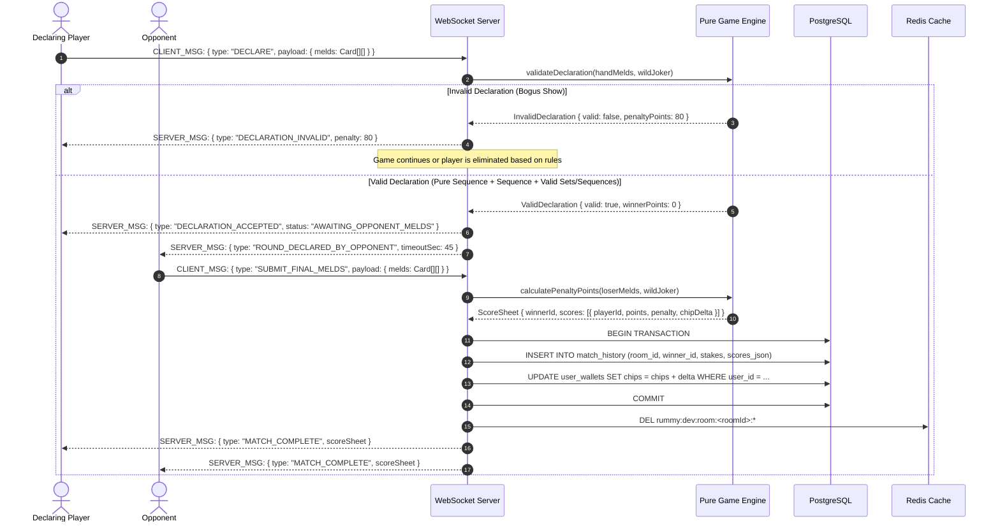
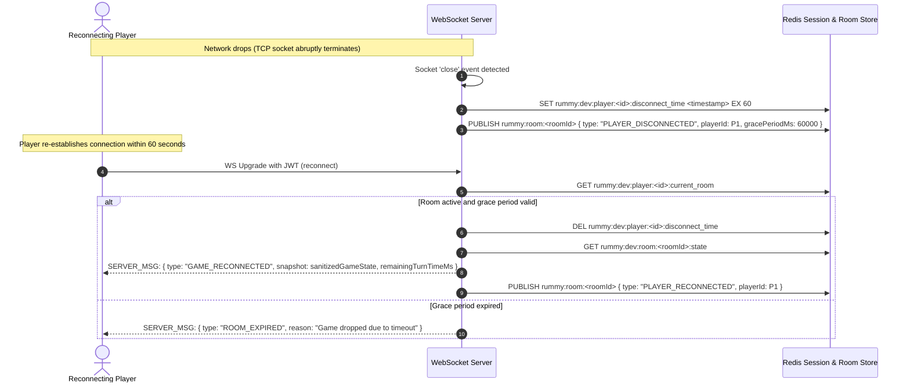

# Real-Time Indian Rummy — Comprehensive System Data Flow

This document details the end-to-end data flows, sequence diagrams, and state transitions across all operational phases of the Indian Rummy platform.

---

## 1. System Topology Overview

```mermaid
graph TD
    Client["Client (Browser / React UI)"]
    
    subgraph Edge ["Edge / API Gateway / Reverse Proxy"]
        Nginx["Reverse Proxy / SSL Termination"]
    end

    subgraph Backend ["Application Cluster"]
        REST["HTTP REST API (Express)"]
        WS["WebSocket Server (Node.js 'ws')"]
        Matchmaker["Matchmaking Engine"]
        Engine["Pure Game Engine Core"]
    end

    subgraph DataStore ["Persistence & Real-Time Caching"]
        Redis[("Redis (Cluster / Sentinel)<br/>• Room State<br/>• Turn Locks<br/>• Matchmaking Queues<br/>• Pub/Sub Events")]
        Postgres[("PostgreSQL 16<br/>• Users & Credentials<br/>• Match History & Audits<br/>• Chips & Player Balances")]
    end

    Client -->|HTTPS (Auth, Lobby, Profile)| Nginx
    Client -->|WSS (Gameplay, Heartbeats)| Nginx
    Nginx -->|HTTP 3000| REST
    Nginx -->|Upgrade WS| WS
    REST --> Postgres
    REST --> Redis
    WS --> Redis
    WS --> Engine
    Matchmaker --> Redis
    Matchmaker --> Postgres
```

---

## 2. Authentication & Session Lifecycle

### 2.1 User Registration & Login


### 2.2 WebSocket Upgrade Handshake & Authentication


---

## 3. Matchmaking & Room Provisioning



---

## 4. Turn Cycle & Concurrency Control

Indian Rummy requires a strict sequential turn order: **Draw Phase -> Discard Phase -> Turn Advancement**.



---

## 5. Turn Expiry & Auto-Play Protocol

```mermaid
sequenceDiagram
    autonumber
    participant Timer as Turn Timer Watcher (Node / Redis)
    participant WS as WebSocket Server
    participant Lock as Redis Lock
    participant Engine as Pure Game Engine
    participant Redis as Redis State
    actor Player as Inactive Player

    Timer->>WS: Event: TurnTimerExpired { roomId, turnPlayerId, turnSeq }
    WS->>Lock: Acquire lock "lock:room:<roomId>"
    WS->>Redis: GET rummy:dev:room:<roomId>:state
    alt Player already completed turn
        WS->>Lock: Release lock (Ignore stale timer)
    else Turn Still Active
        WS->>Engine: executeAutoPlay(state, turnPlayerId)
        Note over Engine: Auto-draws closed deck (if not drawn) and discards drawn card; increments consecutive misses
        Engine-->>WS: { nextState, missedCount, isForfeited }
        WS->>Redis: SET rummy:dev:room:<roomId>:state <nextState>
        WS->>Lock: Release lock
        WS-->>Player: SERVER_MSG: { type: "AUTO_PLAY_EXECUTED", warning: "Turn timed out (1/3 strikes)" }
        alt missedCount >= 3
            WS-->>Player: SERVER_MSG: { type: "PLAYER_FORFEITED", reason: "Consecutive timeouts" }
        end
    end
```

---

## 6. Declaration, Validation & Round Termination



---

## 7. Disconnection & Reconnection Resilience


