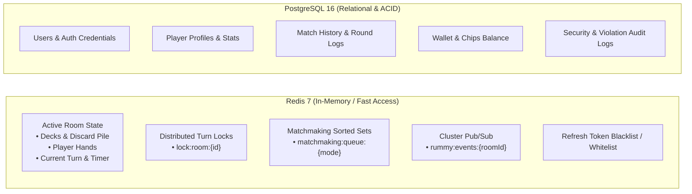
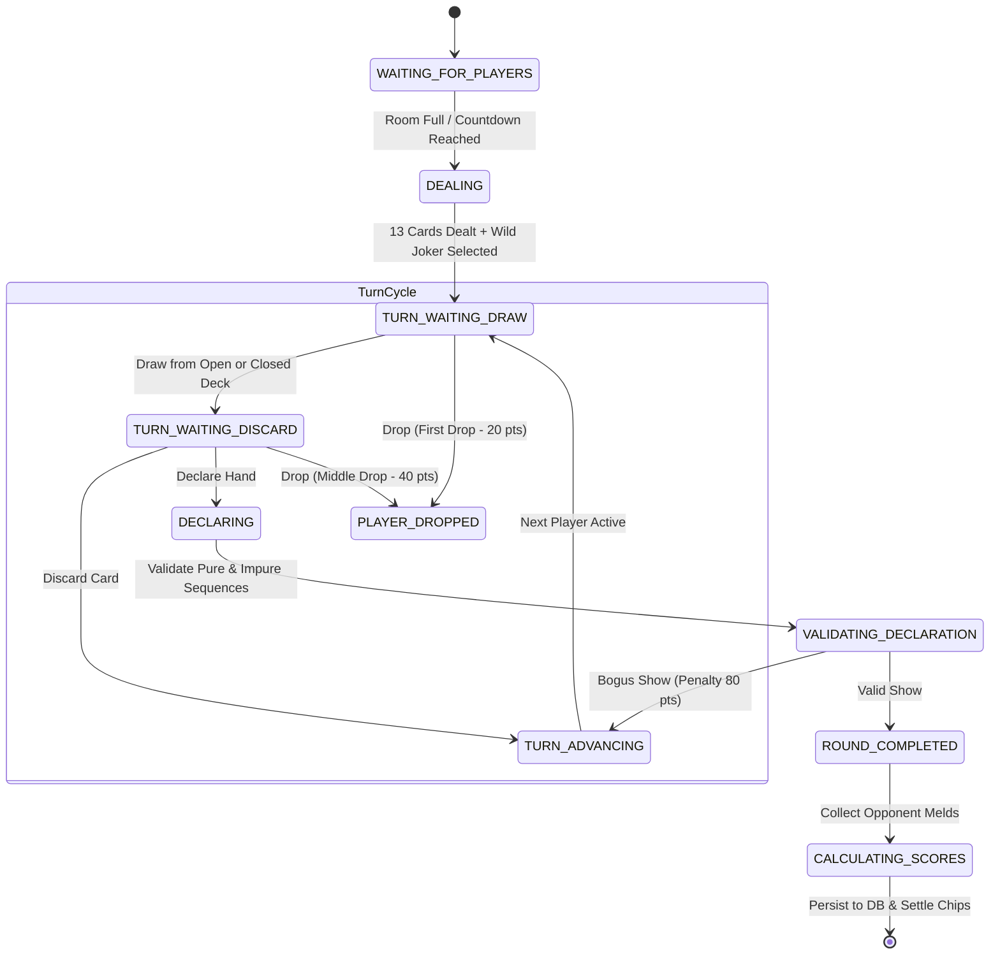

# High-Level System Architecture & Design Specification

## 1. Executive Architectural Philosophy

The Indian Rummy platform is designed as a **high-throughput, low-latency, deterministic, fault-tolerant distributed system**.
The system prioritizes:
1. **Domain Isolation**: Game rules (declarations, scoring, card shuffling) are 100% deterministic, side-effect-free, and transport-agnostic.
2. **Authority & Anti-Cheat**: The server is the single source of truth. The client is purely an untrusted visualization and input terminal. Private card states of opponents are never transmitted over the wire until legitimate end-of-round reveal.
3. **Strict Concurrency Control**: Game turns are atomic transactions protected against race conditions, replay attacks, duplicate submissions, and distributed clock desynchronizations.

---

## 2. Monorepo Topology & Boundaries

```
rummy/
├── apps/
│   ├── web/                    # Client SPA: React 19 + TypeScript + Vite + Tailwind CSS
│   ├── server/                 # Primary Backend: Node.js + Express (REST) + Native WebSocket (ws)
│   └── worker/                 # (Optional/Phase 2) Dedicated Matchmaking & Persisted Background Jobs
├── packages/
│   ├── engine/                 # Pure Rummy Domain Engine (Card, Deck, Melds, Turn FSM, Validator)
│   ├── shared/                 # Shared TypeScript DTOs, Event Schemas, Protocol Enums, Zod Models
│   ├── database/               # Drizzle ORM Schema, PostgreSQL Migrations, Seeders & Repositories
│   └── redis/                  # Redis Client wrapper, Distributed Locks, Stream/PubSub Bus, Key Contracts
├── docker/
│   ├── docker-compose.yml      # Local dev: PostgreSQL 16 + Redis 7
│   └── Dockerfile.*
├── docs/                       # Living architectural & operational documentation
├── .skills                     # Agent Engineering Rules
└── .permissions                # Agent Authority & Operational Bounds
```

### 2.1 Boundary Justifications

| Boundary | Type | Ownership & Responsibility | Why This Boundary Exists |
| :--- | :--- | :--- | :--- |
| `packages/engine` | Pure Domain Package | Card models, deck generation, shuffling, hand grouping, pure/impure sequence validation, set validation, invalid declaration penalty calculation, turn state transitions. | **Zero side-effects**. Must be testable in sub-millisecond unit tests without spinning up databases, networks, or mocking WebSockets. |
| `packages/shared` | Type / Protocol Package | Network contracts (`ClientMessage`, `ServerMessage`), Zod schemas, Card enums, API request/response types. | **Single source of truth**. Ensures frontend and backend never fall out of synchronization on payload schemas. |
| `packages/database` | Persistence Package | Drizzle ORM schemas, migration runners, PostgreSQL connection pool, durable read/write repositories (Users, Matches, Chips). | Centralizes relational schema management and prevents raw SQL or conflicting schemas across apps. |
| `packages/redis` | Distributed State & Caching | Redis client setup, Redlock / atomic Lua scripts, key formatting templates, Pub/Sub channels, TTL definitions. | Decouples ephemeral state management and locking mechanics from HTTP and WebSocket handlers. |
| `apps/server` | Service Host | Hosts both Express REST APIs and the WebSocket server for real-time room sessions. | Eliminates unnecessary distributed network hops between an API gateway, auth service, and game service during initial scaling, while keeping code modularized internally. |
| `apps/web` | Frontend Client | React SPA, visual card table, sounds, micro-animations, client-side optimistic meld sorting, WS connection management. | Separate build pipeline, static asset delivery, completely decoupled from server runtimes. |

---

## 3. Data Ownership & Storage Partitioning



### 3.1 What Lives in Redis vs. PostgreSQL

- **Redis**:
  - Ephemeral game state during an active round.
  - Sub-millisecond distributed locks (`SET NX EX`).
  - Active matchmaking queues.
  - Active player connection presence & heartbeat timestamps.
- **PostgreSQL**:
  - User accounts, salted password hashes, profiles.
  - Finished match records, detailed scoreboards, and penalties.
  - Chip balances, buy-ins, and winnings ledger.
  - Anti-cheat violation logs.

---

## 4. Real-Time WebSocket Architecture

### 4.1 Transport Choice: Native `ws` vs. Socket.io
- **Decision**: Native `ws` over Node.js HTTP Server.
- **Engineering Justification**:
  1. **Zero Protocol Bloat**: Native `ws` operates directly on RFC 6455 without Socket.io's polling fallback, custom packet prefixes, or extra framing overhead.
  2. **Predictable Memory Footprint**: Minimal per-socket allocation; handles 50,000+ concurrent connections per high-memory Node instance with lower memory pressure.
  3. **Explicit Type Safety**: Directly couples with TypeScript unions (`ClientMessage`, `ServerMessage`) without relying on loosely-typed string event emitters.

### 4.2 Connection Lifecycle & Heartbeats
- **Ping/Pong Protocol**:
  - Server sends WebSocket `ping` frame every 30 seconds to connected clients.
  - Client responds with `pong` frame.
  - If a socket fails to respond within 10 seconds, the server forcefully terminates the connection (`socket.terminate()`), triggering the disconnect grace period.
- **Information Hiding Security**:
  - When broadcasting `GAME_STATE` to a room, the server strips other players' card identities, broadcasting only the count of cards in their hand:
    ```typescript
    // Public broadcast
    {
      playerId: "usr_2",
      cardCount: 13,
      hasDrawn: false
    }
    // Private unicast to Player 1 only
    {
      hand: [{ id: "H_7_1", suit: "HEARTS", rank: "7" }, ...]
    }
    ```

---

## 5. Matchmaking Architecture

1. **Queueing Paradigm**: Redis Sorted Sets (`ZSET`).
   - Member: `userId`
   - Score: Ingestion timestamp (FIFO prioritization)
   - Key: `matchmaking:queue:<variant>:<playerCount>:<stake>`
2. **Match Formation Process**:
   - Polling worker or event-driven evaluator executes an atomic Lua script:
     ```lua
     local players = redis.call('ZPOPMIN', KEYS[1], ARGV[1])
     return players
     ```
   - If `ARGV[1]` (e.g., 2 or 6 players) are obtained, a `roomId` is generated, initial cards are dealt by `packages/engine`, and state is written to `rummy:room:<roomId>:state`.
   - Players are notified via WebSocket unicast.

---

## 6. Game Engine Architecture & State Machine

The game engine operates as a deterministic **Finite State Machine (FSM)**:



---

## 7. Scalability & Horizontal Clustered Scaling

When traffic outgrows a single server node:
1. **Stateless WebSocket Nodes**:
   - Multiple `apps/server` nodes sit behind an L4/L7 load balancer with IP Hash sticky sessions or cookie stickiness for the upgrade phase.
2. **Redis Pub/Sub Event Bus**:
   - If Player A is connected to Node 1 and Player B is connected to Node 2 in the same room, Node 1 publishes room events to Redis channel `rummy:events:room:<roomId>`.
   - Node 2 subscribes to the channel and relays the event to Player B's local socket.
3. **Database Read Replicas**:
   - All writes (matches, chip settlements, registrations) target PostgreSQL Primary.
   - Leaderboards and profile views target read replicas.

---

## 8. Failure Boundaries & Recovery

| Failure Mode | Impact | Recovery Strategy |
| :--- | :--- | :--- |
| **Client Internet Disconnect** | Socket closes abruptly | Server starts 60s reconnection grace period. If player's turn arrives, auto-play draws and discards after 30s. If player reconnects within 60s, state snapshot is synced. After 3 consecutive timeouts, player is dropped. |
| **Server Instance Crash** | Connected sockets drop | Clients auto-reconnect to another server node. New node fetches the active room state directly from Redis (`rummy:room:<roomId>:state`). Round resumes without state loss. |
| **Redis Node Failure** | Ephemeral cache lost | In high availability, Redis Sentinel or Redis Cluster initiates automatic failover to replica within < 3 seconds. Active games recover from in-flight memory or restart cleanly. |
| **PostgreSQL Transient Failure** | REST API errors, settlement delayed | Game state remains intact in Redis. Match completion events are queued in a persistent Redis Stream (`rummy:stream:settlements`) and retried with exponential backoff until DB recovers. |
