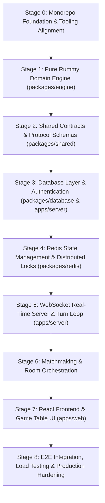

# Master Implementation Build Plan — Indian Rummy Platform

This document is the authoritative roadmap for implementing the production-grade Indian Rummy platform. Each stage must satisfy its exit criteria and pass all automated tests before advancing.

---

## Roadmap Overview

---

## Stage 0: Monorepo Foundation & Tooling Alignment

- **Objective**: Establish unified TypeScript, Turbo, pnpm, Docker, and linting standards across the monorepo.
- **Dependencies**: None.
- **Architecture Decisions**:
  - Unify on pnpm workspaces with Turborepo task caching.
  - Setup local `docker-compose.yml` for PostgreSQL 16 and Redis 7.
  - Standardize on `strict: true` TypeScript across all packages.
- **Tasks**:
  1. Configure root `pnpm-workspace.yaml` and `turbo.json` with build, test, lint, and dev pipelines.
  2. Setup `docker/docker-compose.yml` with health checks for PostgreSQL and Redis.
  3. Create shared base tsconfig (`packages/tsconfig/base.json`).
  4. Clean up prototype placeholder directories (`apps/auth-service`, `apps/game-service`, `packages/utils`).
- **Expected Files / Packages**:
  - `docker/docker-compose.yml`
  - `package.json`, `turbo.json`, `pnpm-workspace.yaml`
  - `tsconfig.base.json`
- **Tests**:
  - Verify Docker containers start and pass health checks.
  - `pnpm install` and `turbo build` run without errors.
- **Security Requirements**: Verify `.gitignore` prevents `.env` or credential tracking.
- **Acceptance Criteria**: Docker containers healthy; monorepo builds cleanly.
- **Risks**: Port collisions on developer machine (5432 / 6379).

---

## Stage 1: Pure Rummy Domain Engine (`packages/engine`)

- **Objective**: Implement a side-effect-free, 100% test-covered domain engine for 13-Card Indian Rummy rules.
- **Dependencies**: Stage 0.
- **Architecture Decisions**:
  - Zero external runtime dependencies. Pure TypeScript functions and immutable data structures where practical.
  - Support 2 standard decks (108 cards including 4 printed jokers) + 1 randomly cut wild joker card.
- **Tasks**:
  1. Define card models (`Suit`, `Rank`, `CardId`, `PrintedJoker`, `WildJoker`).
  2. Implement deck creation, Fisher-Yates cryptographically-seeded shuffle, and deal logic.
  3. Implement Meld evaluation:
     - `isPureSequence(cards)`: >= 3 consecutive cards of same suit, no wild or printed jokers.
     - `isImpureSequence(cards, wildJoker)`: >= 3 cards with wildcard substitutions.
     - `isValidSet(cards, wildJoker)`: 3-4 cards of same rank, distinct suits (or wild substitutions).
  4. Implement hand validation:
     - `isValidDeclaration(melds, wildJoker)`: 13 cards partitioned into melds, >= 2 sequences, at least 1 pure sequence.
  5. Implement penalty scoring:
     - First drop = 20 points, Middle drop = 40 points, Bogus declaration = 80 points.
     - Loser unmatched card point summation (face cards = 10, Ace = 10, pip cards = face value, jokers = 0, capped at 80).
  6. Implement Turn State Machine (Draw -> Discard -> Declare/Drop).
- **Expected Files**:
  - `packages/engine/src/card.ts`
  - `packages/engine/src/deck.ts`
  - `packages/engine/src/meld-validator.ts`
  - `packages/engine/src/declaration.ts`
  - `packages/engine/src/scoring.ts`
  - `packages/engine/src/fsm.ts`
- **Tests**: Comprehensive Vitest suite covering edge cases (Ace-2-3 vs Q-K-A, duplicate cards in sets, multiple jokers in sequences, bogus shows).
- **Acceptance Criteria**: 100% test pass rate across 50+ deterministic rule test scenarios.

---

## Stage 2: Shared Contracts & Protocol Schemas (`packages/shared`)

- **Objective**: Define typed DTOs, WebSocket event schemas, and Zod validators shared across server and client.
- **Dependencies**: Stage 1.
- **Tasks**:
  1. Define `ClientMessage` discriminated union (`DRAW_CARD`, `DISCARD_CARD`, `DECLARE_SHOW`, `DROP_HAND`, `HEARTBEAT`).
  2. Define `ServerMessage` discriminated union (`GAME_STATE_SNAPSHOT`, `PLAYER_ACTION_EVENT`, `TURN_CHANGE`, `ROUND_ENDED`, `ERROR`).
  3. Define Zod validation schemas for all payload data.
- **Expected Files**:
  - `packages/shared/src/messages.ts`
  - `packages/shared/src/dtos.ts`
  - `packages/shared/src/schemas.ts`
- **Tests**: Unit tests validating message serialization and Zod parsing of valid/invalid payloads.

---

## Stage 3: Database Layer & Authentication (`packages/database` & `apps/server`)

- **Objective**: Implement durable storage via PostgreSQL and Drizzle ORM, with secure user authentication and token rotation.
- **Dependencies**: Stage 0, Stage 2.
- **Tasks**:
  1. Define Drizzle schemas: `users`, `user_wallets`, `matches`, `match_scores`, `audit_logs`.
  2. Implement migrations and seeding scripts.
  3. Implement user registration, password hashing (Argon2id), and login endpoints.
  4. Issue short-lived access JWTs (15 min) and persistent refresh tokens with revocation support.
  5. Implement auth middleware for REST endpoints.
- **Tests**: Integration tests for register, login, refresh token, and authenticated profile endpoints.
- **Security Requirements**: Rate limiting on auth endpoints; salted hashes; sanitized inputs.

---

## Stage 4: Redis State Management & Distributed Locks (`packages/redis`)

- **Objective**: Implement fast in-memory room state storage, atomic state mutations, and distributed locks.
- **Dependencies**: Stage 0, Stage 1.
- **Tasks**:
  1. Setup Redis client connection with automatic reconnection and health checks.
  2. Implement distributed turn lock (`acquireLock`, `releaseLock`) using atomic Lua or `SET NX EX`.
  3. Implement state serialization/deserialization for active room state.
  4. Implement turn expiration scheduler and TTL management.
- **Tests**: Concurrency tests simulating 10 simultaneous lock acquisitions; key expiration tests.

---

## Stage 5: WebSocket Real-Time Server & Turn Loop (`apps/server`)

- **Objective**: Implement native WebSocket server with token-based upgrade, room dispatching, and turn management.
- **Dependencies**: Stage 1, Stage 2, Stage 3, Stage 4.
- **Tasks**:
  1. Authenticate WebSocket upgrade requests via JWT.
  2. Implement connection registry and ping-pong heartbeat manager (30s ping, 10s timeout).
  3. Implement message router parsing `ClientMessage` with Zod validation.
  4. Implement Turn Manager: Draw phase, Discard phase, turn rotation, 30s auto-discard timer.
  5. Enforce Information Hiding: Public broadcast vs. private hand unicast.
  6. Implement disconnect grace period (60s) and state resynchronization (`GAME_RECONNECTED`).
- **Tests**: Multi-client WebSocket integration tests running a full simulated 13-card game cycle.

---

## Stage 6: Matchmaking & Room Provisioning

- **Objective**: Implement automated player pairing and dynamic room initialization.
- **Dependencies**: Stage 4, Stage 5.
- **Tasks**:
  1. Implement Redis Sorted Set matchmaking queue (`matchmaking:queue:<mode>:<stake>`).
  2. Implement atomic matchmaker worker to pair 2 or 6 players and initialize table.
  3. Handle queue cancellation and match-ready handshake.
- **Tests**: Concurrency tests with 20 simulated players queuing simultaneously.

---

## Stage 7: React Frontend & Game Table UI (`apps/web`)

- **Objective**: Build a responsive, high-fidelity card game interface using React, Tailwind CSS, and WebSockets.
- **Dependencies**: Stage 2, Stage 5.
- **Tasks**:
  1. Implement Card component, card meld grouper, and drag-and-drop arranger.
  2. Implement Game Table layout (closed deck, open discard pile, wild joker display, opponent indicators).
  3. Implement radial Turn Timer with sound effects and warning states (< 5s).
  4. Implement `useGameSocket` hook with auto-reconnection and state reconciliation.
  5. Implement declaration submission and score breakdown modal.
- **Tests**: Component unit tests (Vitest + React Testing Library); responsive layout checks.

---

## Stage 8: E2E Integration, Load Testing & Production Hardening

- **Objective**: Validate full system resilience, anti-cheat barriers, and concurrent performance.
- **Dependencies**: All prior stages.
- **Tasks**:
  1. End-to-end multi-browser test (Playwright) covering registration -> matchmaking -> gameplay -> declaration -> score persistence.
  2. Load testing WebSocket server under 1,000 concurrent active tables (Artillery / custom load runner).
  3. Production readiness review: structured logging, metrics endpoints, environment variables audit, and health checks.
- **Tests**: 100% automated test suite passing across all packages.
