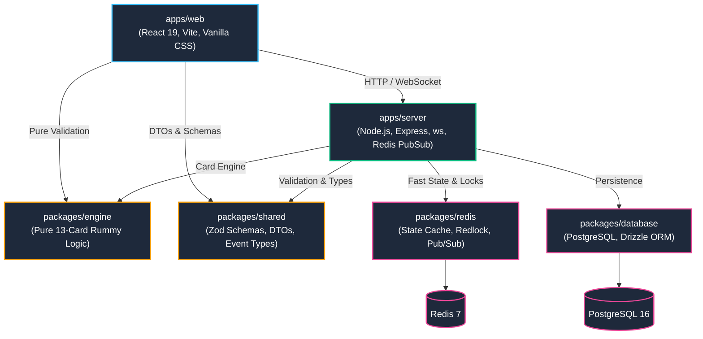
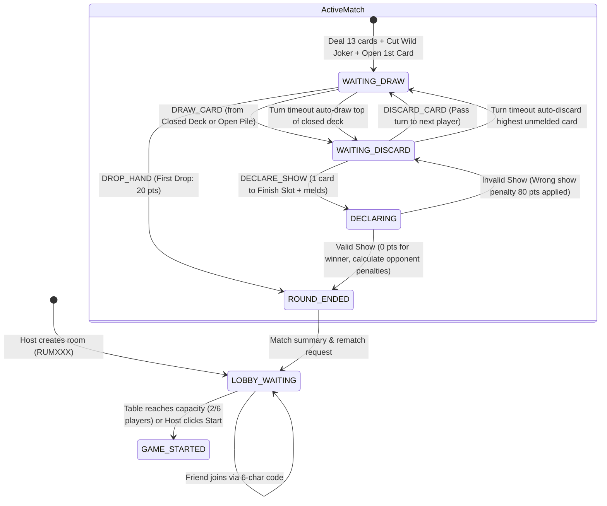
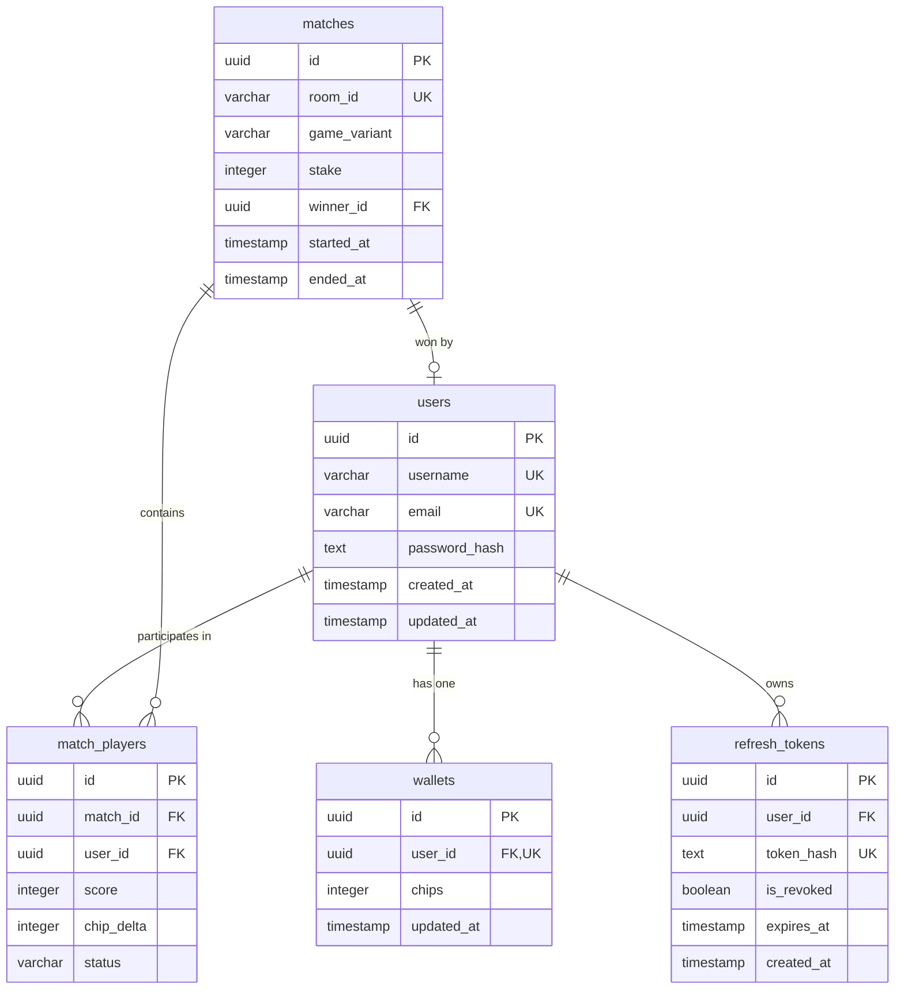
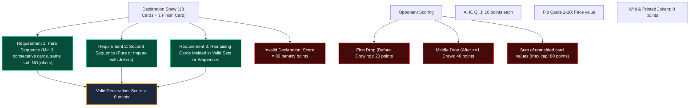
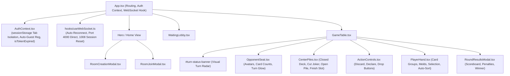

# 13-Card Indian Rummy Platform — Knowledge Graph

This document serves as the **comprehensive technical knowledge graph** of the 13-Card Indian Rummy codebase. It maps system components, boundaries, entity relationships, protocol states, game rules, and frontend workflows. Any AI agent or developer can use this graph to immediately orient themselves and execute changes safely and accurately.

---

## 1. System Architecture & Monorepo Graph

The platform is organized as a high-performance TypeScript monorepo managed with **pnpm** and **Turborepo**.

### Monorepo Workspaces & Responsibilities

| Workspace | Directory | Technology | Primary Responsibility |
|---|---|---|---|
| `@rummy/shared` | `packages/shared/` | TypeScript, Zod | Canonical event contracts, client-server schemas, DTOs, error codes, game constants. |
| `@rummy/engine` | `packages/engine/` | Pure TypeScript (0 deps) | 106-card deck management, wild joker rules, pure/impure sequence validation, set validation, hand point scoring. |
| `@rummy/database` | `packages/database/` | PostgreSQL, Drizzle ORM, pg | Persistent data storage: users, wallets, match histories, refresh tokens, transactional mutations. |
| `@rummy/redis` | `packages/redis/` | Redis (ioredis), Redlock | Sub-millisecond game state cache, distributed mutex locking (`withLock`), turn timers, matchmaking queues. |
| `@rummy/server` | `apps/server/` | Express, `ws`, tsx, Winston | Real-time WebSocket gateway, room lobby coordinator, turn timer scheduling, matchmaking worker. |
| `@rummy/web` | `apps/web/` | React 19, Vite, Vanilla CSS | Responsive multiplayer web interface: casino felt table, turn status banners, room creation modal, guest auth. |

---

## 2. Real-Time Turn & Game State Machine

The game engine operates as a deterministic finite-state machine (FSM). State mutations are guarded by Redis distributed locks (`room:{roomId}:lock`).

### Turn Lifecycle Details

1. **Turn Initialization**:
   - Duration: Default `30,000 ms` (tunable via `TURN_TIMEOUT_SECONDS`).
   - Server runs countdown; broadcasts active user to all connections in room.
2. **Draw Phase (`WAITING_DRAW`)**:
   - Player can tap **Closed Deck** (secret draw) or top card of **Open Pile** (visible draw).
   - Secret card identity is unicast to the active player via `CARD_DRAWN_PRIVATE`.
   - Public draw notice is broadcast to all opponents via `CARD_DRAWN_PUBLIC` (card identity hidden).
3. **Discard Phase (`WAITING_DISCARD`)**:
   - Player selects 1 card from hand (now 14 cards) and clicks **Discard** (moves card to open pile top) OR clicks **Finish Slot** for declaration.
   - Discard triggers `CARD_DISCARDED` and advances `activePlayerId` to `nextActivePlayerId`.
4. **Automatic Turn Timeout**:
   - If player does not act within 30s, server auto-draws from closed deck and auto-discards a non-joker card to keep game moving without stalling.

---

## 3. Database Entity-Relationship Graph

Managed via Drizzle ORM in `packages/database/src/schema/`.

---

## 4. WebSocket Protocol Event Graph

Bidirectional real-time messaging schema validated via Zod (`packages/shared/src/schemas.ts`).

### Client-to-Server Messages

| Event Type | Payload Attributes | Purpose |
|---|---|---|
| `PING` | `{}` | Heartbeat keep-alive frame. |
| `CREATE_ROOM` | `{ maxPlayers: 2 \| 6 }` | Creates new private lobby; generates 6-character room code (`RUMXXX`). |
| `JOIN_ROOM` | `{ roomId: string }` | Joins room via UUID or 6-character room code. |
| `START_ROOM_GAME` | `{ roomId: string }` | Host manual trigger to start match before capacity. |
| `LEAVE_ROOM` | `{ roomId: string }` | Exits waiting lobby. |
| `JOIN_MATCHMAKING` | `{ maxPlayers: 2 \| 6 }` | Enqueues player into matchmaking queue. |
| `LEAVE_MATCHMAKING` | `{}` | Removes player from matchmaking queue. |
| `DRAW_CARD` | `{ roomId: string, source: 'CLOSED' \| 'OPEN' }` | Draws card on active turn. |
| `DISCARD_CARD` | `{ roomId: string, cardId: string }` | Discards card to open pile; ends turn. |
| `DROP_HAND` | `{ roomId: string }` | Forfeits round with minimal drop penalty. |
| `DECLARE_SHOW` | `{ roomId: string, finishCardId: string, melds: CardDto[][] }` | Submits 13-card melds + finish card for show validation. |

### Server-to-Client Messages

| Event Type | Payload Attributes | Delivery |
|---|---|---|
| `CONNECTED` | `{ connectionId, userId, serverTime, message }` | Unicast upon handshake. |
| `PONG` | `{ timestamp }` | Unicast reply to PING. |
| `ROOM_CREATED` | `{ roomId, roomCode, maxPlayers, players, isHost }` | Unicast to room creator. |
| `ROOM_LOBBY_UPDATE` | `{ roomId, roomCode, maxPlayers, players, canStart }` | Broadcast to all room occupants. |
| `GAME_STARTED` | `{ roomId, activePlayerId, wildJoker, openCard, initialHand, players, turnTimeoutMs }` | Multicast to each player (hand is personalized). |
| `CARD_DRAWN_PRIVATE` | `{ roomId, drawnCard, hand }` | Unicast to drawing player. |
| `CARD_DRAWN_PUBLIC` | `{ roomId, playerId, source, cardCount }` | Broadcast to room opponents. |
| `CARD_DISCARDED` | `{ roomId, playerId, discardedCard, nextActivePlayerId, turnTimeoutMs }` | Broadcast to room. |
| `PLAYER_DROPPED` | `{ roomId, playerId, penaltyPoints, nextActivePlayerId }` | Broadcast to room. |
| `DECLARATION_SUBMITTED` | `{ roomId, declarerId }` | Broadcast to room. |
| `ROUND_COMPLETED` | `{ roomId, winnerId, scores, results }` | Broadcast to room. |
| `PLAYER_DISCONNECTED` | `{ roomId, playerId }` | Broadcast to room. |
| `PLAYER_RECONNECTED` | `{ roomId, playerId }` | Broadcast to room. |
| `ERROR` | `{ code, message, details? }` | Unicast on failure. |

---

## 5. Indian Rummy Engine Rules Knowledge Graph

Implemented strictly in `packages/engine/src/validator.ts` and `deck.ts`.

---

## 6. Frontend Component & State Graph

Located in `apps/web/src/`.

---

## 7. Operational Quick-Reference

- **Start Infrastructure**: `docker compose -f docker/docker-compose.yml up -d`
- **Apply Database Migrations**: `pnpm --filter @rummy/database db:migrate`
- **Run All Unit Tests**: `pnpm -r test`
- **Run End-to-End Browser Test**: `pnpm test:e2e`
- **Run Typecheck**: `pnpm -r typecheck`
- **Start Backend**: `pnpm --filter @rummy/server dev` (Port `4000`)
- **Start Frontend**: `pnpm --filter @rummy/web dev` (Port `3000`)
- **Clean Service Logs**: `pnpm clear:logs`
