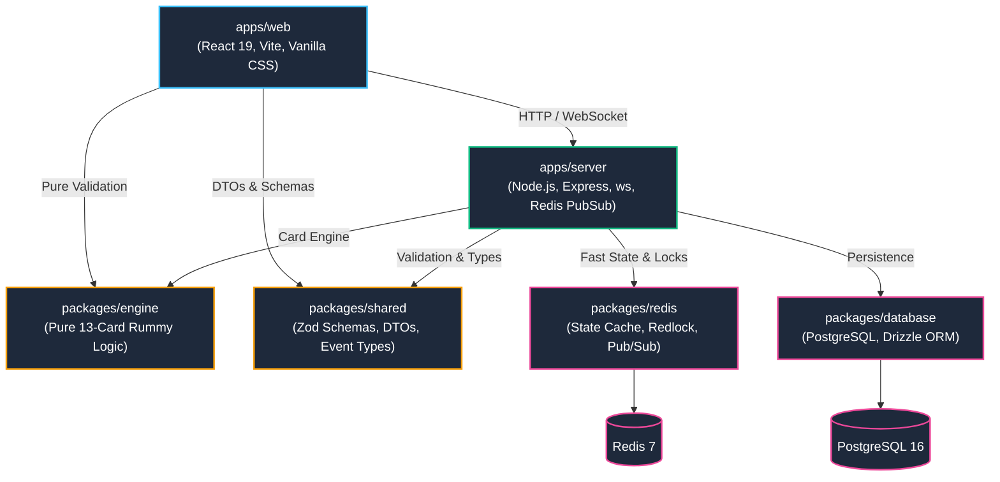
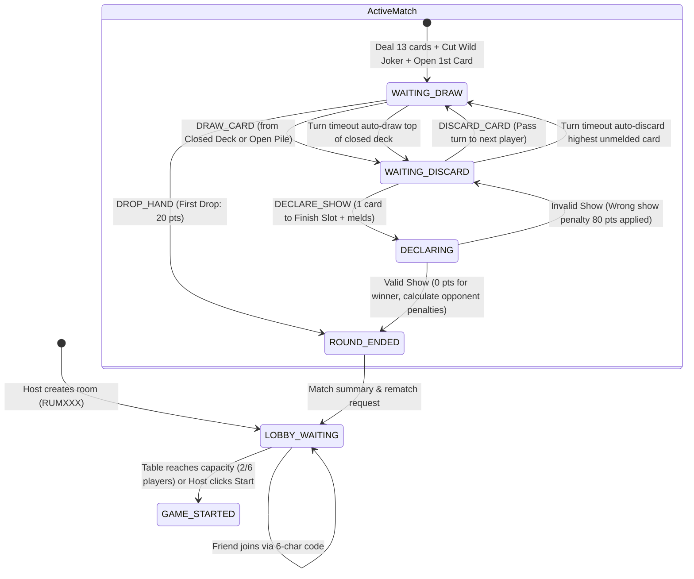
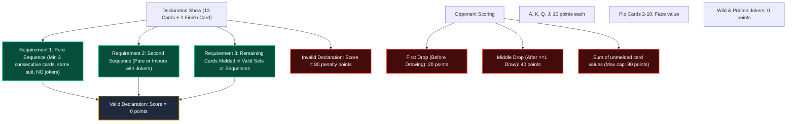

# Rummy Master (13-Card Indian Rummy Platform) — Knowledge Graph

This document serves as the **comprehensive technical knowledge graph** of the Rummy Master codebase. It maps system components, boundaries, entity relationships, protocol states, game rules, and frontend workflows. Any AI agent or developer can use this graph to immediately orient themselves and execute changes safely and accurately.

---

## 1. System Architecture & Monorepo Graph

The platform is organized as a high-performance TypeScript monorepo managed with **pnpm** and **Turborepo**.



### Monorepo Workspaces & Responsibilities

| Workspace | Directory | Technology | Primary Responsibility |
|---|---|---|---|
| `@rummy/shared` | `packages/shared/` | TypeScript, Zod | Canonical event contracts, client-server schemas, DTOs, error codes, game constants. |
| `@rummy/engine` | `packages/engine/` | Pure TypeScript (0 deps) | 106-card deck management, wild joker rules, pure/impure sequence validation, set validation, hand point scoring. |
| `@rummy/database` | `packages/database/` | PostgreSQL, Drizzle ORM, pg | Persistent data storage: users, wallets, match histories, refresh tokens, transactional mutations. |
| `@rummy/redis` | `packages/redis/` | Redis (ioredis), Redlock | Sub-millisecond game state cache, distributed mutex locking (`withLock`), turn timers, matchmaking queues. |
| `@rummy/server` | `apps/server/` | Express, `ws`, tsx, Winston | Real-time WebSocket gateway, room lobby coordinator, turn timer scheduling, matchmaking worker, OTP verification service, analytics telemetry, RBAC admin endpoints. |
| `@rummy/web` | `apps/web/` | React 19, Vite, Vanilla CSS | Responsive multiplayer web interface: casino felt table, turn status banners, room creation modal, auth modal (login/register/OTP), admin analytics dashboard. |

---

## 2. Real-Time Turn & Game State Machine

The game engine operates as a deterministic finite-state machine (FSM). State mutations are guarded by Redis distributed locks (`room:{roomId}:lock`).



### Turn Lifecycle Details

1. **Turn Initialization**:
   - Duration: Default `30,000 ms` (tunable via `TURN_TIMEOUT_SECONDS`).
   - Server runs countdown; broadcasts active user to all connections in room.
2. **Draw Phase (`WAITING_DRAW`)**:
   - Player can tap **Closed Deck** (secret draw) or top card of **Open Pile** (visible draw).
   - Secret card identity is unicast to the active player via `CARD_DRAWN_PRIVATE`.
   - Public draw notice is broadcast to all opponents via `CARD_DRAWN_PUBLIC` (card identity hidden).
3. **Discard Phase (`WAITING_DISCARD`)**:
   - Player selects 1 card from hand (now 14 cards) and clicks **Discard** (moves card to open pile top) OR clicks **Finish Slot** for declaration.
   - Discard triggers `CARD_DISCARDED` and advances `activePlayerId` to `nextActivePlayerId`.
4. **Automatic Turn Timeout**:
   - If player does not act within 30s, server auto-draws from closed deck and auto-discards a non-joker card to keep game moving without stalling.

---

## 3. Database Entity-Relationship Graph

Managed via Drizzle ORM in `packages/database/src/schema/`.

```mermaid
erDiagram
    users ||--o{ wallets : "has one"
    users ||--o{ refresh_tokens : "owns"
    users ||--o{ match_players : "participates in"
    users ||--o{ otp_verifications : "receives"
    users ||--o{ analytics_events : "triggers"
    matches ||--o{ match_players : "contains"
    matches ||--o| users : "won by"

    users {
        uuid id PK
        varchar username UK
        varchar email UK
        varchar phone UK
        text password_hash
        varchar role "USER or ADMIN"
        boolean is_verified
        timestamp created_at
        timestamp updated_at
    }

    wallets {
        uuid id PK
        uuid user_id FK_UK
        integer chips
        timestamp updated_at
    }

    refresh_tokens {
        uuid id PK
        uuid user_id FK
        text token_hash UK
        boolean is_revoked
        timestamp expires_at
        timestamp created_at
    }

    otp_verifications {
        uuid id PK
        varchar identifier "email or phone"
        text otp_hash
        varchar purpose "SIGNUP"
        timestamp expires_at
        integer attempts
        boolean is_used
        timestamp created_at
    }

    analytics_events {
        uuid id PK
        uuid user_id FK
        varchar event_type
        text metadata
        varchar ip_address
        timestamp created_at
    }

    matches {
        uuid id PK
        varchar room_id UK
        varchar game_variant
        integer stake
        uuid winner_id FK
        timestamp started_at
        timestamp ended_at
    }

    match_players {
        uuid id PK
        uuid match_id FK
        uuid user_id FK
        integer score
        integer chip_delta
        varchar status
    }
```

---

## 4. REST API Routes

### Authentication Routes (`/api/auth`)

| Method | Endpoint | Auth | Purpose |
|---|---|---|---|
| `POST` | `/api/auth/register` | None | Register guest user (username + password). |
| `POST` | `/api/auth/send-otp` | None | Send 6-digit OTP to email or phone. Rate limited to 1/60s per identifier. |
| `POST` | `/api/auth/register-with-otp` | None | Verify OTP + register verified account (username + identifier + password). |
| `POST` | `/api/auth/login` | None | Flexible login (username, email, or phone + password). Returns JWT with role claim. |
| `POST` | `/api/auth/guest` | None | Create anonymous guest account with auto-generated username. |
| `PATCH` | `/api/auth/profile/username` | JWT | Update display name for guest or registered user and issue fresh access token. |

### Admin Routes (`/api/admin`) — Protected: `authenticateToken` + `requireAdmin`

| Method | Endpoint | Purpose |
|---|---|---|
| `GET` | `/api/admin/metrics` | Platform KPIs: total users, verified, phone/email breakdown, active sockets, active tables, total matches, chip economy. |
| `GET` | `/api/admin/users` | Paginated user list with activity stats (limit/offset query params). |
| `GET` | `/api/admin/tables` | Real-time active table states from the room coordinator. |

### Room Routes (`/api/rooms`)

| Method | Endpoint | Auth | Purpose |
|---|---|---|---|
| `GET` | `/api/rooms/:id` | JWT | Get room details. |

---

## 5. WebSocket Protocol Event Graph

Bidirectional real-time messaging schema validated via Zod (`packages/shared/src/schemas.ts`).

### Client-to-Server Messages

| Event Type | Payload Attributes | Purpose |
|---|---|---|
| `PING` | `{}` | Heartbeat keep-alive frame. |
| `CREATE_ROOM` | `{ maxPlayers: 2 \| 6 }` | Creates new private lobby; generates 6-character room code (`RUMXXX`). |
| `JOIN_ROOM` | `{ roomId: string }` | Joins room via UUID or 6-character room code. |
| `START_ROOM_GAME` | `{ roomId: string }` | Host manual trigger to start match before capacity. |
| `LEAVE_ROOM` | `{ roomId: string }` | Exits waiting lobby. |
| `JOIN_MATCHMAKING` | `{ maxPlayers: 2 \| 6 }` | Enqueues player into matchmaking queue. |
| `LEAVE_MATCHMAKING` | `{}` | Removes player from matchmaking queue. |
| `DRAW_CARD` | `{ roomId: string, source: 'CLOSED' \| 'OPEN' }` | Draws card on active turn. |
| `DISCARD_CARD` | `{ roomId: string, cardId: string }` | Discards card to open pile; ends turn. |
| `DROP_HAND` | `{ roomId: string }` | Forfeits round with minimal drop penalty. |
| `DECLARE_SHOW` | `{ roomId: string, finishCardId: string, melds: CardDto[][] }` | Submits 13-card melds + finish card for show validation. |

### Server-to-Client Messages

| Event Type | Payload Attributes | Delivery |
|---|---|---|
| `CONNECTED` | `{ connectionId, userId, serverTime, message }` | Unicast upon handshake. |
| `PONG` | `{ timestamp }` | Unicast reply to PING. |
| `ROOM_CREATED` | `{ roomId, roomCode, maxPlayers, players, isHost }` | Unicast to room creator. |
| `ROOM_LOBBY_UPDATE` | `{ roomId, roomCode, maxPlayers, players, canStart }` | Broadcast to all room occupants. |
| `GAME_STARTED` | `{ roomId, activePlayerId, wildJoker, openCard, initialHand, players, turnTimeoutMs }` | Multicast to each player (hand is personalized). |
| `CARD_DRAWN_PRIVATE` | `{ roomId, drawnCard, hand }` | Unicast to drawing player. |
| `CARD_DRAWN_PUBLIC` | `{ roomId, playerId, source, cardCount }` | Broadcast to room opponents. |
| `CARD_DISCARDED` | `{ roomId, playerId, discardedCard, nextActivePlayerId, turnTimeoutMs }` | Broadcast to room. |
| `PLAYER_DROPPED` | `{ roomId, playerId, penaltyPoints, nextActivePlayerId }` | Broadcast to room. |
| `DECLARATION_SUBMITTED` | `{ roomId, declarerId }` | Broadcast to room. |
| `ROUND_COMPLETED` | `{ roomId, winnerId, scores, results }` | Broadcast to room. Triggers full cleanup of active game state, Redis room lobby, and room code mapping so completed rooms cannot be rejoined as ghost matches. |
| `PLAYER_DISCONNECTED` | `{ roomId, playerId }` | Broadcast to room. |
| `PLAYER_RECONNECTED` | `{ roomId, playerId }` | Broadcast to room. |
| `ERROR` | `{ code, message, details? }` | Unicast on failure. |

---

## 6. Indian Rummy Engine Rules Knowledge Graph

Implemented strictly in `packages/engine/src/validator.ts` and `deck.ts`.



---

## 7. Frontend Component & State Graph

Located in `apps/web/src/`.

```mermaid
graph TD
    App["App.tsx (Routing, Auth Context, WebSocket Hook)"]
    
    App --> AuthContext["AuthContext.tsx<br/>(sessionStorage Tab Isolation, Auto-Guest Reg, isTokenExpired, login, sendOtp, registerWithOtp)"]
    App --> UseWS["hooks/useWebSocket.ts<br/>(Auto Reconnect, Port 4000 Direct, 1008 Session Reset)"]
    
    App --> ViewHero["Hero / Home View"]
    App --> ViewLobby["WaitingLobby.tsx"]
    App --> ViewTable["GameTable.tsx"]
    App --> ViewAdmin["AdminDashboard.tsx<br/>(Admin-only, RBAC gated)"]
    App --> ModalAuth["AuthModal.tsx<br/>(Sign In / Register with OTP)"]
    
    ViewHero --> ModalCreate["RoomCreationModal.tsx"]
    ViewHero --> ModalJoin["RoomJoinModal.tsx"]
    
    ModalAuth --> TabLogin["Sign In Tab<br/>(Username/Email/Phone + Password)"]
    ModalAuth --> TabRegister["Register Tab<br/>(Step 1: Details, Step 2: OTP Verify)"]
    
    ViewAdmin --> KPIGrid["Metric KPI Grid<br/>(Users, Sockets, Tables, Matches, Chips)"]
    ViewAdmin --> TableMonitor["Live Table Monitor"]
    ViewAdmin --> UserAudit["User Management Audit Table"]
    
    ViewTable --> TurnBanner["#turn-status-banner (Visual Turn Radar)"]
    ViewTable --> Opponents["OpponentSeat.tsx (Avatars, Card Counts, Turn Glow)"]
    ViewTable --> Center["CenterPiles.tsx (Closed Deck, Cut Joker, Open Pile, Finish Slot)"]
    ViewTable --> ActionControls["ActionControls.tsx (Discard, Declare, Drop Buttons)"]
    ViewTable --> PlayerHand["PlayerHand.tsx (Card Groups, Melds, Selection, Auto-Sort)"]
    ViewTable --> ModalResults["RoundResultsModal.tsx (Scoreboard, Penalties, Winner)"]
```



---

## 8. Server Middleware & Service Layer

### Express Middleware Stack

| Middleware | File | Purpose |
|---|---|---|
| `authenticateToken` | `middleware/auth.ts` | Extracts and verifies JWT from `Authorization: Bearer` header. Injects `req.user` with `id`, `username`, `role`. |
| `requireAdmin` | `middleware/admin.ts` | Rejects non-ADMIN users with `403 FORBIDDEN`. Stacks after `authenticateToken`. |

### Backend Services

| Service | File | Purpose |
|---|---|---|
| `OtpService` | `services/otp-service.ts` | Cryptographic 6-digit OTP generation (`crypto.randomInt`), SHA-256 hashing, 10-minute expiry, rate limiting (1/60s), max 3 attempt lockout. Dev mode returns `devOtpCode`. |
| `EmailService` | `services/email-service.ts` | SMTP email dispatcher via Nodemailer. Configured with Brevo SMTP relay (`smtp-relay.brevo.com:587`) via `.env`. Generates branded HTML emails with 6-digit OTPs. Falls back to Ethereal dev email preview when unconfigured. |
| `AnalyticsService` | `services/analytics-service.ts` | Asynchronous telemetry event recorder. Dispatches `USER_REGISTERED`, `USER_LOGIN`, `ROOM_CREATED`, `MATCH_STARTED`, `MATCH_FINISHED` events to PostgreSQL. |

### Admin Seed on Startup

The server auto-seeds a default administrator account on startup if no `ADMIN` role user exists:
- **Email**: `admin@rummy.pro`
- **Password**: `AdminPassword123!`
- **Role**: `ADMIN`
- **Verified**: `true`

---

## 9. Frontend UI Architecture & Root Components

The web application enforces human-grade craftsmanship adhering to anti-vibe design standards (`.agents/skills/anti-vibe-design/` and `.agents/skills/ui-ux-pro-max/`):

| Root Component | Location | Variants / Capabilities |
|---|---|---|
| `Button` | `components/ui/Button.tsx` | Variants: `primary`, `gold`, `secondary`, `outline`, `ghost`, `danger`. Sizes: `sm`, `md`, `lg`. Active compression (`scale(0.98)`), accessible focus rings, loading spinner. |
| `Input` | `components/ui/Input.tsx` | Label, error validation, helper text, left/right icons, password reveal toggle (`showPasswordToggle`), crisp focus glow. |
| `Dropdown` | `components/ui/Dropdown.tsx` | Accessible option selection with label, helper text, custom chevron, and focus rings. |
| `Modal` | `components/ui/Modal.tsx` | Accessible dialog with backdrop blur, focus trapping, Escape dismissal, responsive card layout. |
| `OtpInput` | `components/ui/OtpInput.tsx` | 6 discrete digit inputs with clipboard paste auto-distribution, backspace navigation, tabular numerals. |
| `GuestNameModal` | `components/Lobby/GuestNameModal.tsx` | Non-blocking display name customization for guest players before creating or joining rooms. |

---

## 10. Operational Quick-Reference & Scripts Directory

All operational and maintenance scripts reside in `scripts/` (documented in [scripts/README.md](file:///home/saptgiri7/Desktop/rummy/scripts/README.md)):

- **Start All Services**: `pnpm start` (`bash scripts/start.sh`) — Docker + backend + frontend (extracts & displays LAN Network URLs for multi-device testing)
- **Stop All Services**: `pnpm stop` (`bash scripts/stop.sh`) — apps + Docker (preserves volumes)
- **Stop + Wipe Data**: `pnpm stop -- --wipe` — full reset including Docker volumes
- **Run Migrations**: `pnpm migrate` (`bash scripts/migrate.sh`) — apply pending migrations
- **Generate Migration**: `pnpm migrate -- --generate` — create SQL from schema changes
- **Fresh DB Reset**: `pnpm migrate -- --fresh` — wipe volumes + re-apply all migrations
- **Snapshot Recovery**: `pnpm recover:snapshot` (`bash scripts/recover-snapshot.sh`)
- **Clean Logs**: `pnpm clear:logs` (`bash scripts/clear-logs.sh`)
- **Export Chat Transcripts**: `python3 scripts/export_chat.py` — exports IDE session transcripts to Markdown ([docs/previous-conversation.md](file:///home/saptgiri7/Desktop/rummy/docs/previous-conversation.md)) and standalone HTML app ([docs/previous-conversation-viewer.html](file:///home/saptgiri7/Desktop/rummy/docs/previous-conversation-viewer.html))
- **Run All Unit Tests**: `pnpm -r test`
- **Run E2E Browser Test**: `pnpm test:e2e`
- **Run Typecheck**: `pnpm -r typecheck`

---

## 11. Test Coverage Matrix

| Test File | Type | Coverage |
|---|---|---|
| `apps/server/src/__tests__/otp.test.ts` | Unit | OTP generation, hashing, rate limiting, attempt lockout, expiry validation. |
| `apps/server/src/__tests__/admin.test.ts` | Unit | Admin metrics aggregation, RBAC middleware enforcement, user listing. |
| `apps/server/src/__tests__/auth.test.ts` | Unit | Registration, login (username/email/phone), JWT token claims with role. |
| `apps/server/src/__tests__/rooms.test.ts` | Unit | Room creation, joining, lobby updates, capacity enforcement. |
| `apps/server/src/__tests__/websocket.test.ts` | Integration | WebSocket handshake, message routing, connection lifecycle. |
| `apps/server/src/__tests__/e2e-simulation.test.ts` | Integration | Full game simulation (deal, draw, discard, declare). |
| `apps/web/e2e/multiplayer.spec.ts` | E2E (Playwright) | 2-browser multiplayer: room creation, join, game start, turn cycle. |
| `apps/web/e2e/auth-admin.spec.ts` | E2E (Playwright) | OTP registration, flexible login, admin dashboard access, KPI display. |

---

## 12. Project Snapshots & Version Milestones

| Snapshot Name | Git Tag | Git Branch | Recovery Command | Description |
|---|---|---|---|---|
| `Stage 8 Stable` | `v1.0.0-multiplayer-stable` | `snapshot/stage-8-stable` | `pnpm recover:snapshot` | Complete, verified 13-card Indian Rummy platform with real-time multiplayer, turn radar banner, clean DB schema, anti-vibe design, automated recovery script, and passing Playwright E2E suite. [snapshots/README.md](file:///home/saptgiri7/Desktop/rummy/snapshots/README.md) |
